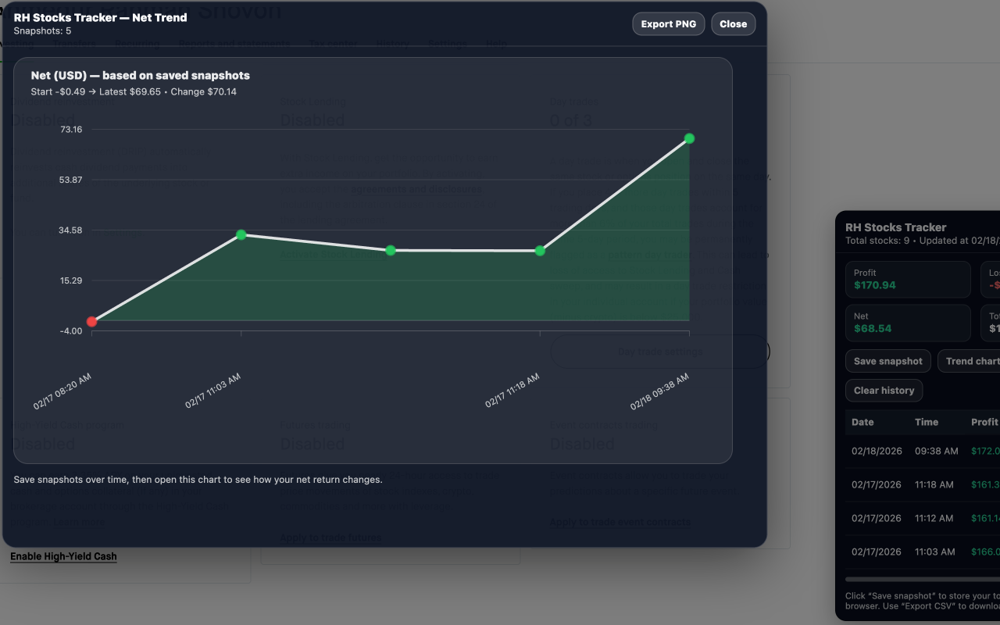

# RH Stocks Tracker

A lightweight Chrome extension that adds a small summary panel on the Robinhood Account Investing page: https://robinhood.com/account/investing

It reads visible stock table data and calculates:

- Profit
- Loss
- Net
- Total Equity
- Total number of stocks

You can save snapshots locally and view a trend chart of your net return over time.

## Demo

- Video demonstration: https://youtu.be/-X7-qvpMuSs

## Features

- Always-on summary panel 
- Save Snapshot at will (stores data locally in Chrome storage)
- History table of snapshots
- Export CSV (history download)
- Trend chart (Net over time)
- Export PNG of the chart

---

## Installation

Install from the Chrome Web Store:

https://chromewebstore.google.com/detail/rh-stocks-tracker/fgmbdlbfokjdaceljikidnpadofliljf

## How to Use

1. After installing the extension, open the Robinhood Account Investing page: https://robinhood.com/account/investing
2. The panel appears automatically and updates in real time.
3. Click “Save snapshot” to store current totals locally.
4. Click “Trend chart” to view net return over time.
5. Use “Export CSV” to download history.
6. Use “Export PNG” inside the chart to save an image.

If the panel does not appear, please try refreshing the page.

---

## Data Storage and Privacy

Snapshots are stored locally using Chrome storage.

- Data is saved only when you click “Save snapshot”
- Only visible stock table data from the Investing page is parsed
- No personal identifiers are collected

RH Stocks Tracker:

- Does not send data to any server
- Does not use analytics
- Does not collect personal information
- Does not track browsing activity
- Does not access login credentials

To remove stored data:

- Click “Clear history” in the panel
- Remove the extension
- Or clear extension storage via Chrome settings

The full privacy policy is available at:

https://arshovon.com/rh-stocks-tracker/privacy-policy

---

## Support

If you have a feature suggestion, improvement idea, or discover a bug, please open an issue on GitHub: https://github.com/arsho/rh-stocks-tracker/issues

Clear steps to reproduce a problem and screenshots (if applicable) are appreciated.

---

## Trademark Disclaimer

Robinhood® is a registered trademark of Robinhood Markets, Inc.

This extension is not affiliated with, endorsed by, or sponsored by Robinhood Markets, Inc. The term “Robinhood” is used solely to describe compatibility with the Robinhood Investing page.
