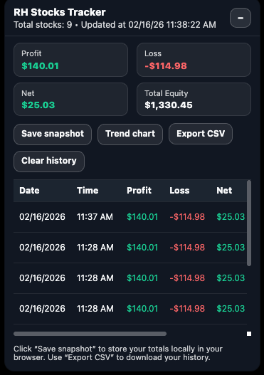

# RH Stocks Tracker

A lightweight Chrome extension that adds a small panel on Robinhood’s **Investing** page to summarize **Profit**, **Loss**, **Net**, and **Total Equity**. You can **save snapshots locally** and view a **trend chart** of your net return over time.

## What it does

Opening Robinhood account investing page [https://robinhood.com/account/investing](https://robinhood.com/account/investing), 
this extension adds a panel that shows:

- Profit (sum of positive “Total return”)
- Loss (sum of negative “Total return”)
- Net (Profit + Loss)
- Total Equity (sum of equity across holdings)
- Total stocks (count of parsed holdings)
- Trend chart of net value over time

## Features

- **Always-on summary panel** (no clicks required to see totals)
- **Save snapshot** button stores a row in your browser (Chrome local storage)
- **History table** with **Delete** per row
- **Export CSV** (2 decimal places everywhere)
- **Trend chart overlay** (Net over time)
    - Works with **0 / 1 / many** snapshots
    - Uses **dynamic x-axis labels** to avoid overlap
    - Uses a **0 baseline** and colors fills:
        - Green only above 0
        - Red only below 0
    - **Export PNG** of the chart

## Data storage and privacy

Snapshots are stored locally using Chrome storage:
- Stored only when you click **Save snapshot**
- It parses only the publicly displayed holdings data on the Investing page.

RH Stocks Tracker:
- Does not send any data to any server
- Does not use analytics
- Does not collect personal information
- Does not track you across sites
- Stores data only in your browser using chrome.storage.local
- Saves a history row only when you click “Save snapshot”

To remove all stored data:
- Click “Clear history” in the panel, OR
- Remove the extension, OR
- Clear extension storage via Chrome extension settings

## Install (local)

1. Download/clone this repository.
2. Open Chrome: `chrome://extensions`
3. Enable **Developer mode**
4. Click **Load unpacked**
5. Select the folder that contains `manifest.json`

Then open:
- https://robinhood.com/account/investing

## How to use

1. Open Robinhood Investing page.
2. The panel appears and updates automatically.
3. Click **Save snapshot** to store the current totals.
4. Click **Trend chart** to view net return over time.
5. Click **Export CSV** to download history.
6. Click **Export PNG** inside the chart to save an image.

## Notes

- The extension reads on-screen values from the holdings table.
- If the page is still rendering, equity may briefly show “not parsed yet”; scrolling slightly and waiting usually resolves it.
- This project is not affiliated with Robinhood.

### Trademark disclaimer

Robinhood® is a registered trademark of Robinhood Markets, Inc.
This extension is not affiliated with, endorsed by, or sponsored by Robinhood Markets, Inc.
The word “Robinhood” is used only to describe compatibility with the Robinhood Investing page.